# Azure Data

## Objectifs

Cet atelier montre comment mettre plusieurs services Azure Data au sein d'une application .Net Core dans App Service.

## Créer la Web App

### Créer un resource group

La commande `az group create` est une commande qui créé un groupe de ressource dans la souscription courante.

Dans Cloud Shell, éxécutez la commande suivante pour créer un resource-group temporaire:

```azurecli-interactive
az group create -n <rg_name> --location westeurope
```

### Créer un plan App Service

La commande `az appservice plan create` est une commande qui créé un plan d'app service dans le resource group spécifié.

Dans Cloud Shell, éxécutez la commande suivante:

```azurecli-interactive
az appservice plan create -n <plan_name> -g <rg_name> -l westeurope --sku B1
```

### Créer une web app

La commande `az webapp create` est une commande qui créé une application App Service dans le resource group spécifié.

Dans Cloud Shell, éxécutez la commande suivante:

```azurecli-interactive
az webapp create -n <app_name> -p <plan_name> -g <rg_name>
```

### Accéder à l’application

Pour accéder à l’application déployée à l’aide de votre navigateur web, vous devrez vous rendre à l'adresse `https://<app_name>.azurewebsites.net` dans laquelle vous remplacerez <app_name> par le nom de votre application.

**Félicitations !** Vous avez créé votre première application via la CLI Azure.

## Déployer la Web App

### Activer Git via le Deployment Center

Depuis le portail, cliquez sur `Resource groups`, sélectionnez votre groupe puis l'application web App Service que vous venez de créer.
Dans la page qui s'ouvre sélectionnez `Deployment center`, `Local Git` et validez le formulaire.


Une fois le repository Git créé, revenez sur l'onglet `Overview` de votre App Service et vous devriez voir l'adresse du nouveau repository.

⚠️ Il vous sera demandé de renseigner des credentials pour effectuer les commandes Git de synchronisation.
Si vous ne l'avez jamais fait, [créez vos identifiants depuis le portail](https://docs.microsoft.com/azure/app-service/deploy-configure-credentials).

### Cloner le code

Ouvrez votre invite de commande, créez un répertoire temporaire et placez le shell dans ce nouveau répertoire.

```bash
mkdir azdev-webapp-git

cd azdev-webapp-git
```

Clonez ensuite le référentiel de l’exemple dans votre répertoire avec la commande suivante.

```bash
git clone https://github.com/wilfriedwoivre/labs-intro-azure-data.git
```

Placez le shell dans ce nouveau répertoire.

```bash
cd labs-intro-azure-data
```

### Déployer l'application via Git

Nous allons désormais ajouter la référence au nouveau repository de code. Pour cela, éxécutez les commandes suivantes en remplaçant `<git clone url>` par l'adresse de votre repository:

```bash
git remote add azure <git clone url>
```

```bash
git remote -v
```

Cette commande vous affiche la liste des `origins` définies. Voici ce que vous devriez voir:

```bash
azure   https://az-wwo-webapp-mc.scm.azurewebsites.net:443/az-wwo-webapp-mc.git (fetch)
azure   https://az-wwo-webapp-mc.scm.azurewebsites.net:443/az-wwo-webapp-mc.git (push)
origin  https://github.com/wilfriedwoivre/labs-intro-azure-data.git (fetch)
origin  https://github.com/wilfriedwoivre/labs-intro-azure-data.git (push)
```

Déployer notre application sur notre WebApp

```bash
git push azure master
```

## Accéder à l’application

Pour accéder à l’application déployée à l’aide de votre navigateur web, vous devrez vous rendre à l'adresse `https://<app_name>.azurewebsites.net`. Remplacez simplement <app_name> par le nom de votre application.

---

# Data

## Cosmos DB

### Créer une instance CosmosDB

Dans votre Resource Group, créez un Cosmos DB en cliquand sur le bouton `Add` puis en choisissant `Cosmos DB`


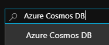

Cliquez enfin sur le bouton `Create`.

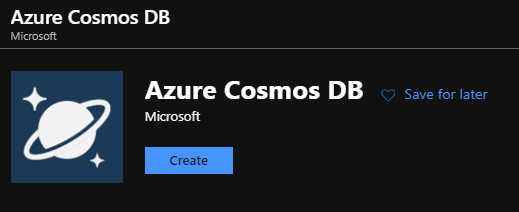

Choisissez un nom de compte unique.
Pour le champ `API`, choisissez `Core (SQL)`.

Pour les options `Geo-Redondancy` et `Multi-region Writes` choisissez `Disable`

Validez le formulaire avec le bouton `Review and create`, puis appuyez sur le bouton `Create`.

### Récupérer les informations de connexion

Dans votre Cosmos DB, allez récupérer vos clés dans l'interface suivante :

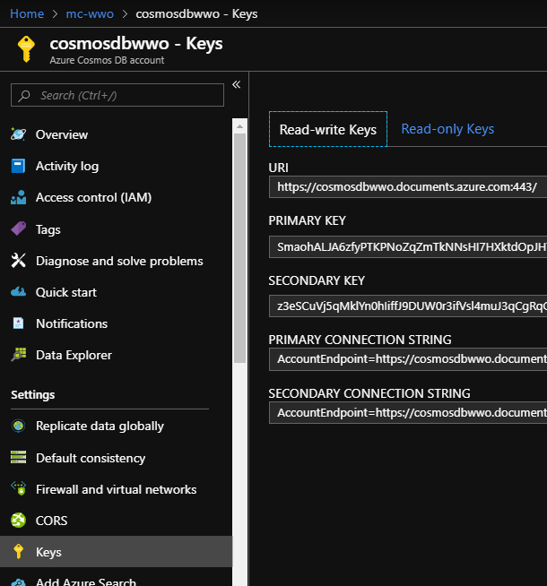

Copiez les éléments suivants dans un notepad

- URI
- Primary Key

### Configurer votre Web App

Dans votre Web App, dans la blade `Configuration`

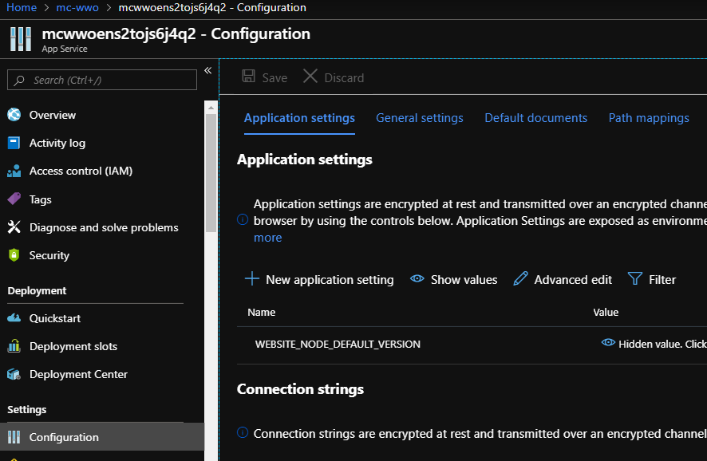

Ajoutez les éléments suivants en tant que `New Application Setting`

- CosmosDB__endpoint : `Votre URI récupéré précédemment`
- CosmosDB__key : `Votre Primary Key récupéré précédemment`

Sauvegardez vos nouvelles configuration, et rafraichissez votre application Web afin de pouvoir essayer l'onglet CosmosDB

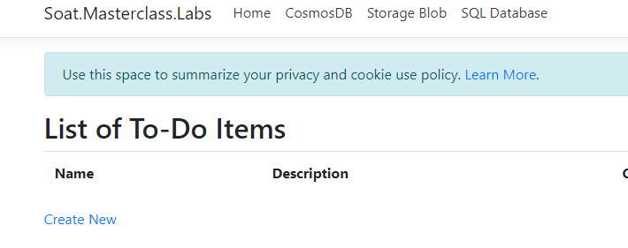

### Consulter vos données

Après avoir créé un ou pluseurs éléments depuis le site de lab. Vous pouvez les consulter via la blade `Data Explorer` de votre Cosmos DB

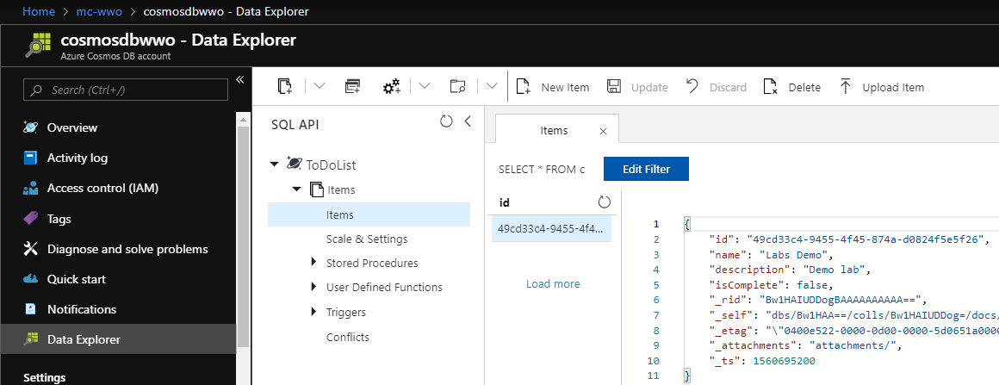

## Storage Account

### Créez un compte de stockage

Dans votre Resource Group, créez un Storage Account en cliquand sur le bouton `Add` puis en choisissant `Storage Account`


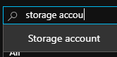

Cliquez enfin sur le bouton `Create`.


Choisissez un nom de compte unique.
Pour le champ `Replication`, choisissez `Locally-redundant storage (LRS)`.

Validez le formulaire avec le bouton `Review and create`, puis appuyez sur le bouton `Create`.

### Récupérer les informations de connexion

Dans votre Storage Account, allez récupérer vos clés dans l'interface suivante :

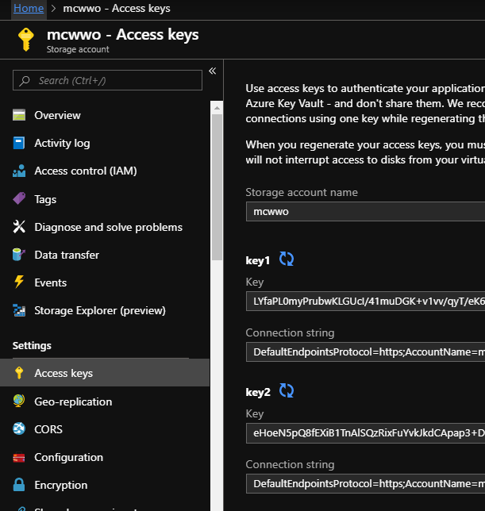

Copiez les éléments suivants dans un notepad

- Storage Account Name
- Key1

### Configurer votre Web App

Dans votre Web App, dans la blade `Configuration`


Ajoutez les éléments suivants en tant que `New Application Setting`

- Storage__accountName : `Votre Storage Account Name récupéré précédemment`
- Storage__accountKey : `Votre Key1 récupéré précédemment`

Sauvegardez vos nouvelles configuration, et rafraichissez votre application Web afin de pouvoir essayer l'onglet Storage Blob

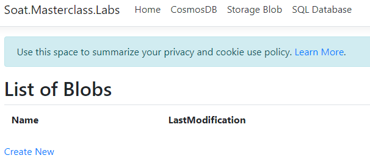

### Consulter vos données

Après avoir créé un ou pluseurs éléments depuis le site de lab. Vous pouvez les consulter via la blade `Storage Explorer (preview)` de votre Storage Blob

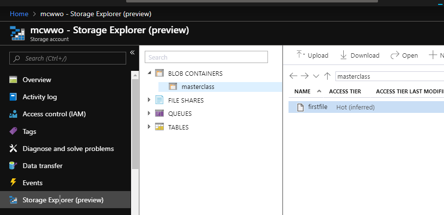

## SQL

### Créez un compte SQL Database

Dans votre Resource Group, créez un SQL Database en cliquand sur le bouton `Add` puis en choisissant `SQL`


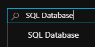

Cliquez enfin sur le bouton `Create`.

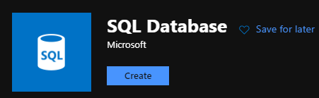

Choisissez un nom de base unique.
Créez un nouveau serveur. 

Pour la partie `Compute+Storage` choisissez Basic comme ci-dessous :

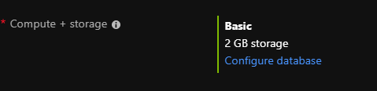

Validez le formulaire avec le bouton `Review and create`, puis appuyez sur le bouton `Create`.

### Récupérer les informations de connexion

Dans votre Storage Account, allez récupérer votre chaine de connexion dans l'interface suivante :

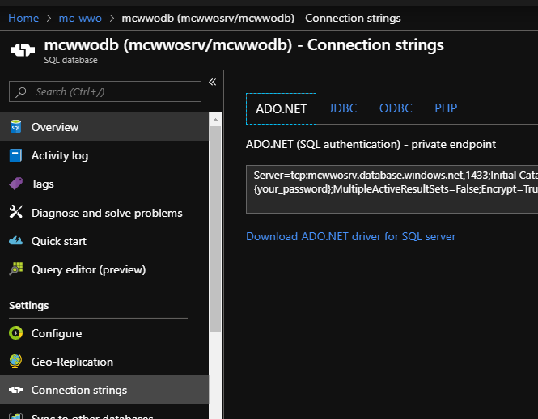

N'oubliez pas de remplacer les champs `your_login` et `your_password`

### Configurer votre Web App

Dans votre Web App, dans la blade `Configuration`


Ajoutez les éléments suivants en tant que `New Connection String`

- DbConnection : `Votre connection string récupéré précédemment`
- Type : SQL Azure

Sauvegardez vos nouvelles configuration, et rafraichissez votre application Web afin de pouvoir essayer l'onglet SQL Database


### Consulter vos données

Après avoir créé un ou pluseurs éléments depuis le site de lab. Vous pouvez les consulter via la blade `Query Editor (preview)` de votre SQL Database

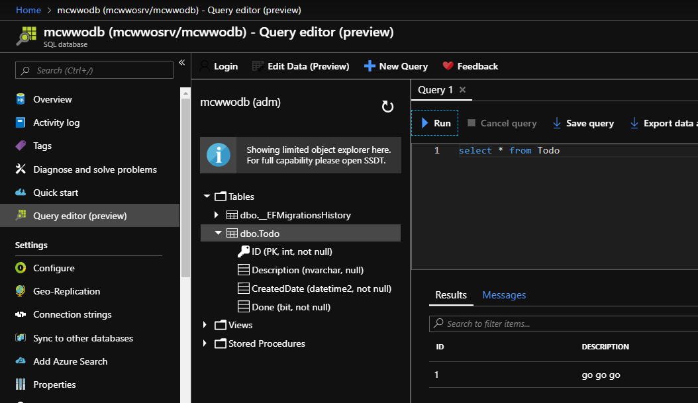

## Supprimer des ressources

Au cours des étapes précédentes, vous avez créé des ressources Azure au sein d’un groupe de ressources. Si vous ne pensez pas avoir besoin de ces ressources à l’avenir, supprimez le groupe de ressources.

L’exécution de cette action peut prendre plusieurs minutes.
