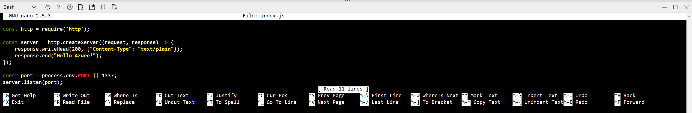

# az webapp up

## Objectifs

Cet atelier montre comment déployer une application Node.js dans App Service à l’aide de [Cloud Shell](https://docs.microsoft.com/azure/cloud-shell/overview) et la CLI Azure.

Vous pouvez réaliser cet atelier dans Cloud Shell ou localement avec [Azure CLI](https://docs.microsoft.com/fr-fr/cli/azure/install-azure-cli).

## Commande az webapp

La commande `az webapp up` est une commande expérimentale qui exécute les actions suivantes :

- Créer un groupe de ressources par défaut

- Créer un plan App Service par défaut

- Créer une Web App avec les paramêtres par défaut et le nom spécifié

- Zipper et déployer les fichiers du répertoire en cours vers la web app sur Azure

## Cloner le code

Dans Cloud Shell, créez un répertoire temporaire et placez le shell dans ce nouveau répertoire.

```bash
mkdir azdev-webapp

cd azdev-webapp
```

Clonez ensuite le référentiel de l’exemple dans votre répertoire avec la commande suivante.

```bash
git clone https://github.com/Azure-Samples/nodejs-docs-hello-world
```

> [!NOTE]
> L’exemple de fichier index.js définit le port d’écoute sur process.env.PORT. Cette variable d’environnement est affectée par App Service.

## Créer une web app

Déplacez le shell dans le répertoire qui contient l’exemple de code et exécutez la commande `az webapp up`.

Dans l’exemple suivant, remplacez <nom de l’application> par un nom d’application unique, le <resourcegroup_name> par le nom de votre RG et le <location> par votre région Azure

```bash
cd nodejs-docs-hello-world

az webapp up -n <app_name> -g <resourcegroup_name> --sku B1 -l <location>
```

L’exécution de cette commande peut prendre quelques minutes. Pendant son exécution, des informations semblables à ce qui suit s’affichent :

```json
Creating Resource group 'appsvc_rg_Linux_CentralUS' ...
Resource group creation complete
Creating App service plan 'appsvc_asp_Linux_CentralUS' ...
App service plan creation complete
Creating app '<app_name>' ....
Webapp creation complete
Updating app settings to enable build after deployment
Creating zip with contents of dir /home/username/quickstart/nodejs-docs-hello-world ...
Preparing to deploy and build contents to app.
Fetching changes.

Generating deployment script.
Generating deployment script.
Generating deployment script.
Running deployment command...
Running deployment command...
Running deployment command...
Deployment successful.
All done.
{
  "app_url": "https://<app_name>.azurewebsites.net",
  "location": "Central US",
  "name": "<app_name>",
  "os": "Linux",
  "resourcegroup": "appsvc_rg_Linux_CentralUS ",
  "serverfarm": "appsvc_asp_Linux_CentralUS",
  "sku": "STANDARD",
  "src_path": "/home/username/quickstart/nodejs-docs-hello-world ",
  "version_detected": "6.9",
  "version_to_create": "node|6.9"
}
```

## Accéder à l’application

Dans la sortie de la commande précédente vous pourrez noter
Deployment successful.

```bash
All done.
{
  "app_url": "https://<app_name>.azurewebsites.net",
  ...
```

Pour accéder à l’application déployée à l’aide de votre navigateur web, vous devrez vous rendre à l'adresse `https://<app_name>.azurewebsites.net` dans laquelle vous remplacerez <app_name> par le nom de votre application.

L’exemple de code Node.js s’exécute dans App Service sur Linux avec une image intégrée.


**Félicitations !** Vous avez déployé votre première application Node.js sur App Service sur Linux.

## Mettre à jour et redéployer le code

Dans Cloud Shell, tapez `nano index.js` pour ouvrir l’éditeur de texte nano.



Apportez une petite modification au texte de l’appel pour `response.end` :

```nodejs
response.end("Hello Azure!");
```

Enregistrez vos modifications et quittez nano. Utilisez la commande `^O` pour enregistrer et `^X` pour quitter.

Vous allez maintenant redéployer l’application. Remplacez `<app_name>` par votre application.

```bash
az webapp up -n <app_name> --sku B1
```

Une fois le déploiement terminé, revenez à la fenêtre du navigateur que vous avez ouverte à l’étape **Accéder à l’application**, puis actualisez la page.


## Supprimer des ressources

Au cours des étapes précédentes, vous avez créé des ressources Azure au sein d’un groupe de ressources. Si vous ne pensez pas avoir besoin de ces ressources à l’avenir, supprimez le groupe de ressources dans Cloud Shell. Si vous avez modifié la région, mettez à jour le nom du groupe de ressources `appsvc_rg_Linux_CentralUS` pour utiliser le groupe de ressources spécifique à votre application.

```azurecli-interactive
az group delete --name appsvc_rg_Linux_CentralUS
```

L’exécution de cette commande peut prendre une minute.
